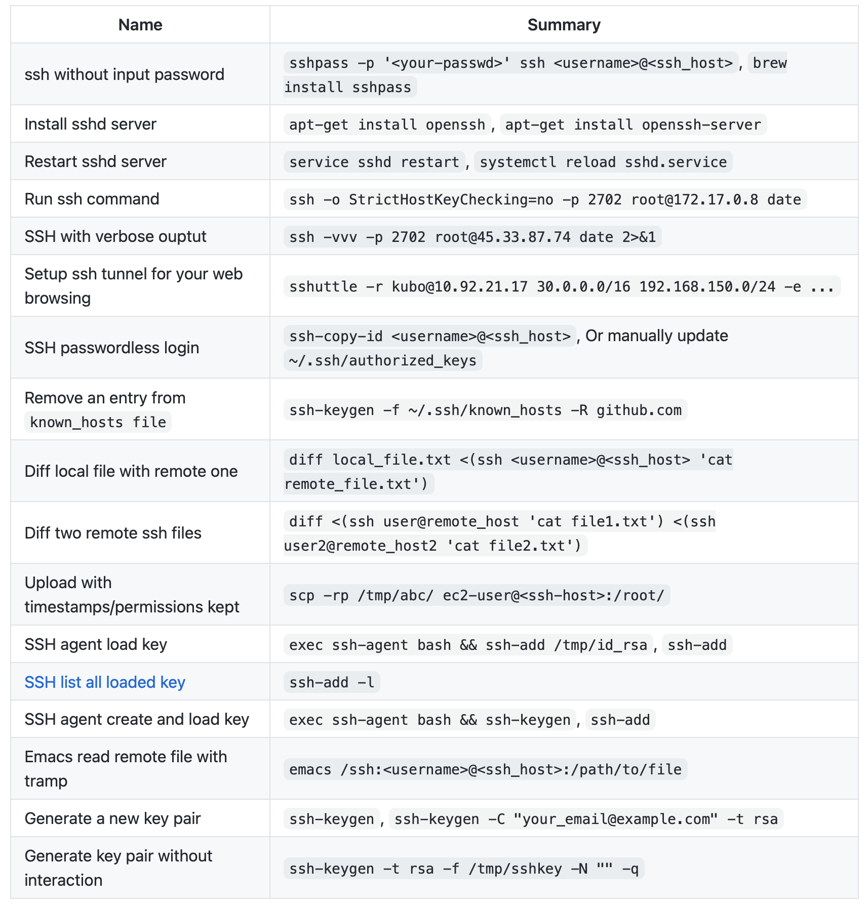
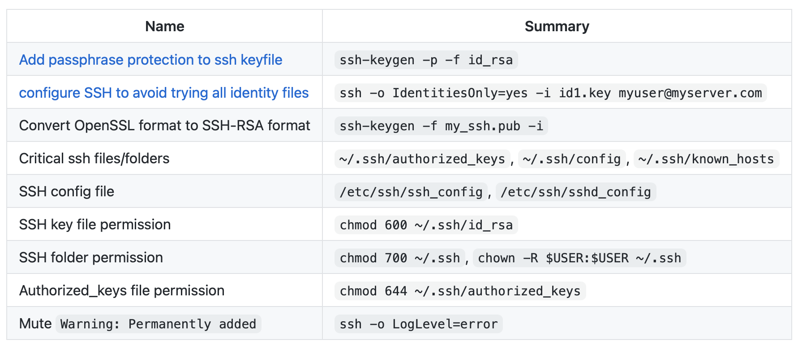
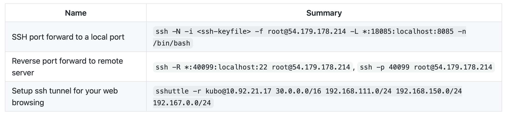
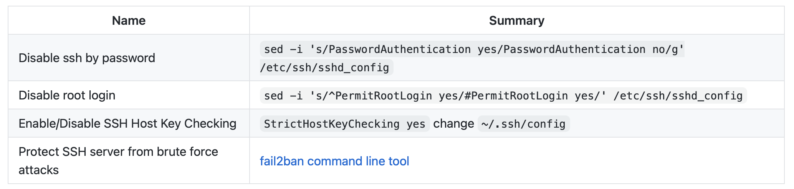
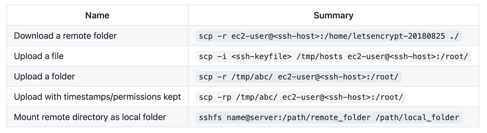
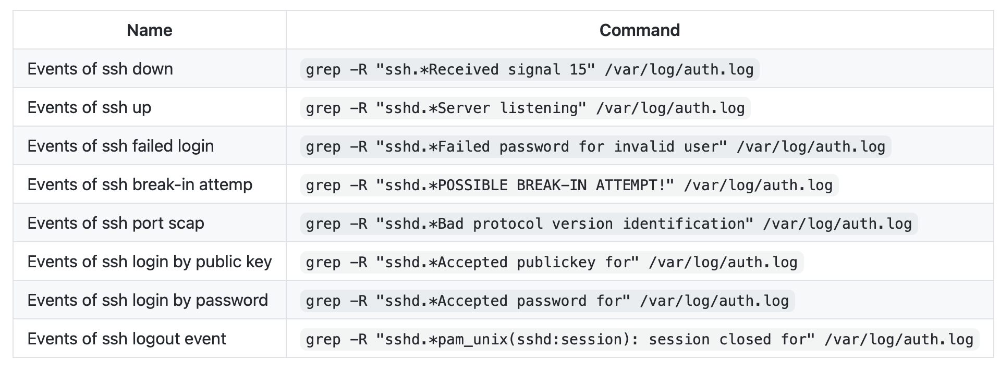

# SSH-Cheatsheet
A Cheatsheet on (Secure Shell) SSH command 

## SSH Basics

## SSH Advanced

## SSH tunnel & SSH proxy

## SSH security

## SCP

## Parse SSH log file

### Credits

Thanks to [Dennyzhang](https://www.dennyzhang.com) for his great work. Check his Blog for cheatsheets on Kubernetes, Docker, Jenkins, Git, DevOps etc.
